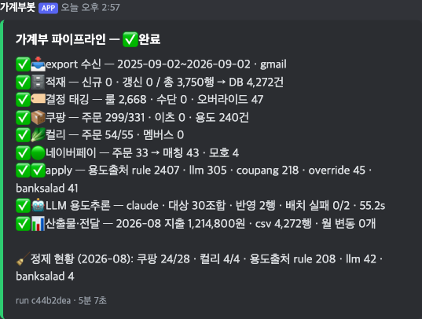
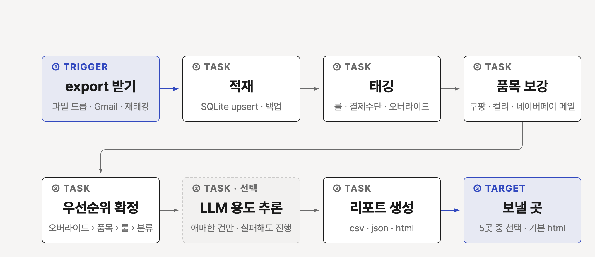
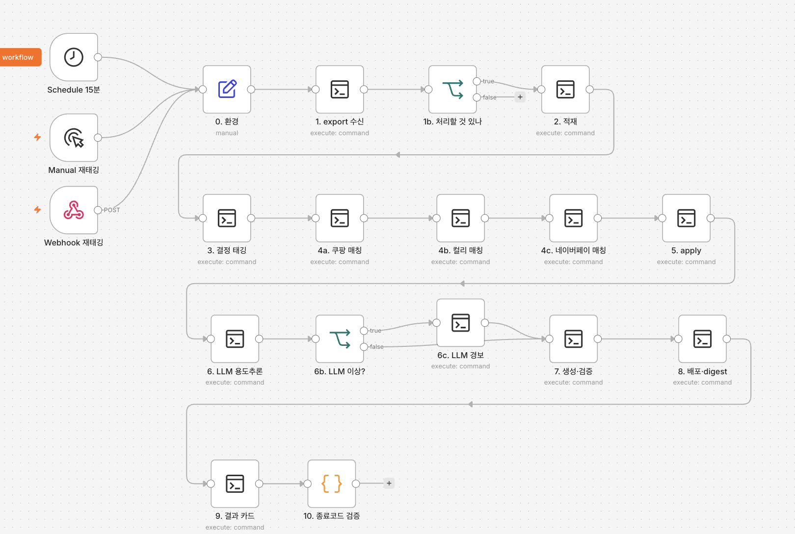
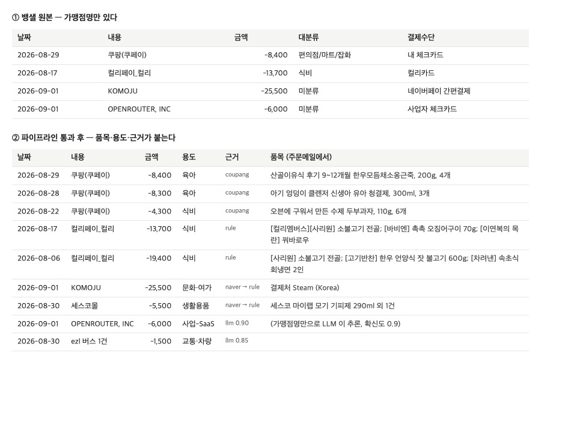
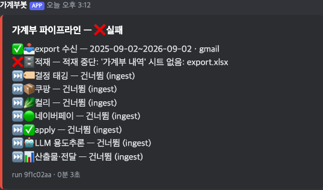
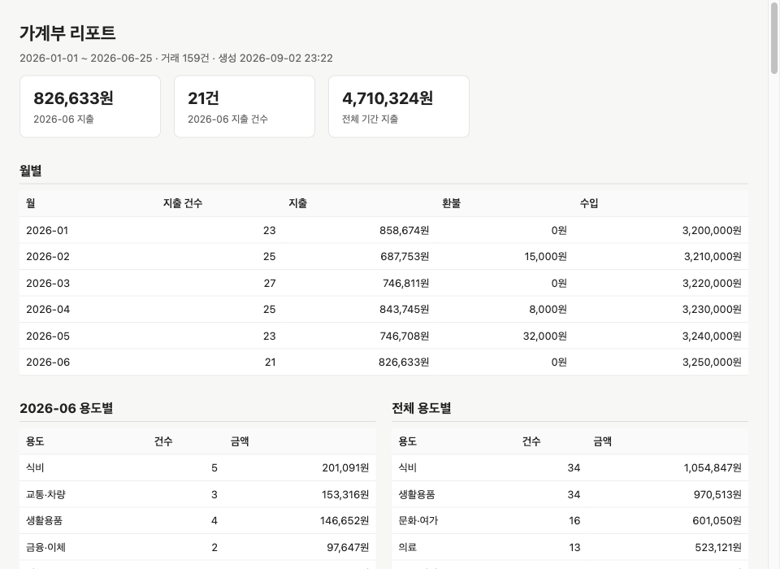
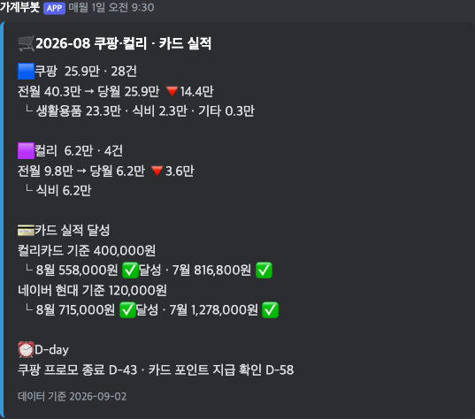
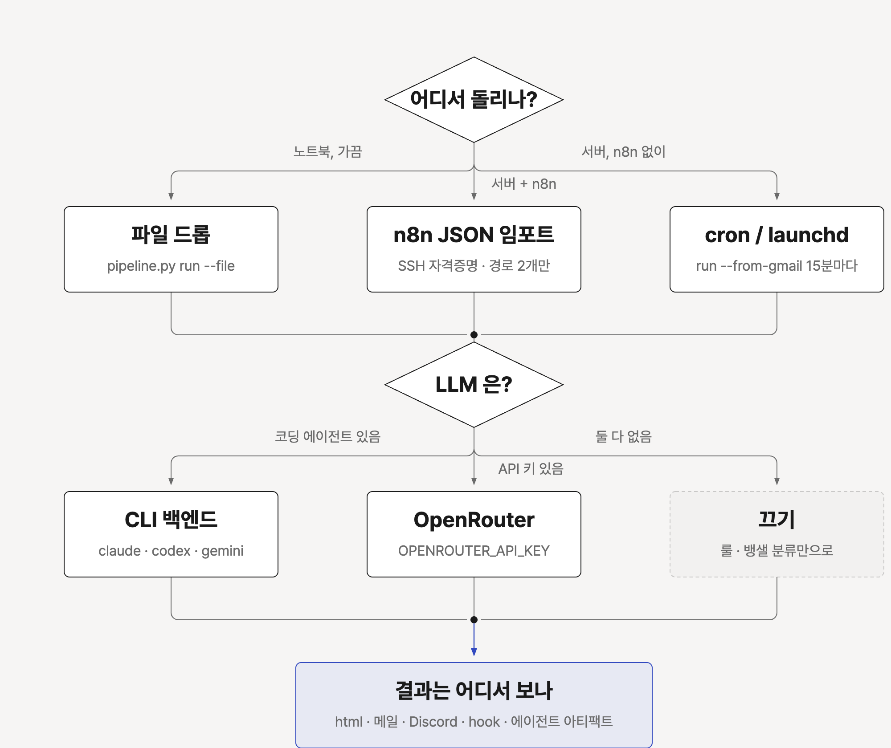

# banksalad-autobudget

뱅크샐러드 가계부를 자동으로 정리하는 게으른 가계부
<p align="center"></p>

## 1. 목적

뱅크샐러드 카드 내역은 가맹점 이름뿐. "쿠팡(쿠페이) 8,400원"만 보고는 이유식인지 세제인지 모름. 메일을 통해 빈칸을 채우기

| 하는 일 | 방법 |
|---|---|
| 거래를 누적 DB 로 쌓는다 | export xlsx 를 SQLite 에 upsert. 앱에서 재분류한 것도 다음 export 에 반영된다 |
| 용도를 붙인다 | 가맹점 룰, 결제수단, 건별 판정 순서로 태깅 |
| 품목을 붙인다 | 쿠팡, 컬리, 네이버페이 주문메일을 읽어 거래에 매칭 |
| 애매한 건만 LLM 에 묻는다 | 룰에 안 걸린 것만. 확신도 낮으면 버린다 |
| 리포트를 원하는 곳으로 보낸다 | HTML 파일, 메일, Discord, 직접 만든 스크립트, AI 에이전트 아티팩트 |

n8n 으로 운영하던 것을 n8n 없이도 돌아가게 정리한 공개판. 사람이 하는 일은 뱅샐 앱에서
"설정 → 데이터 내보내기 → 파일로 받기" 한 번

## 2. 워크플로우


<p align="center"></p>

| 단계 | 명령 | 하는 일 | 실패하면 |
|---|---|---|---|
| Trigger | `fetch-export` | 파일 드롭, Gmail 수신, 재태깅 중 하나 | 파이프라인 시작 안 함 |
| 적재 | `ingest` | DB 백업 후 upsert | 이후 단계 전부 건너뜀 |
| 태깅 | `tag` | 룰, 결제수단, 오버라이드 | 이후 단계 전부 건너뜀 |
| 품목 보강 | `match-coupang` `match-kurly` `match-naver` | 주문메일에서 품목을 붙인다 | Gmail 토큰 없으면 건너뜀 |
| 우선순위 확정 | `apply` | 오버라이드 > 품목 > 룰 > 뱅샐 분류 | 이후 단계 전부 건너뜀 |
| LLM 용도 추론 | `llm` | 뱅샐 분류만 남은 건만 | 경고만 남기고 계속 |
| 리포트 생성 | `export` | csv, json, html 생성 후 Target 으로 전달 | 카드에 실패 표시 |
| Target | `finish` | 결과 카드 발송, 락 해제 | 항상 실행 |

상류가 죽으면 하류는 낡은 DB 위에서 돌지 않는다. 실패 단계 하나만 빨갛게 남고 나머지는 "건너뜀"이 된다.

n8n 으로 돌리면 캔버스가 이 표 그대로다. 노드 하나가 단계 하나라 어디서 멈췄는지 바로 보인다.

<p align="center"></p>

## 3. 실제 예시

금액은 공개용으로 줄였다. 품목과 근거 표기는 실제 출력 그대로다.

### 원본과 결과

위가 뱅샐 원본, 아래가 파이프라인을 지난 뒤다. 가맹점 이름만 있던 행에 품목, 용도, 근거가 붙는다.

<p align="center"></p>

근거 열을 읽는 법:

- `coupang`: 주문메일 품목으로 용도를 정했다. 쿠팡 전표는 전부 "쿠팡(쿠페이)"라 이게 없으면 생활용품과 이유식을 못 가른다.
- `rule`: 가맹점 룰 파일이 잡았다. 사람이 정한 판정이라 LLM 보다 세다.
- `naver → rule`: 네이버페이 메일에서 실제 결제처(Steam, 세스코몰)를 끌어온 뒤 룰이 잡았다.
- `llm 0.90`: 룰에도 안 걸리고 뱅샐 분류도 미분류인 건. 확신도 0.6 미만은 버린다.

### 결과 카드

실행이 끝나면 Discord 에 카드 한 장이 온다. 단계별 건수와 최근 달 정제 현황이 실린다.

<p align="center"></p>

실패하면 어디서 끊겼는지 보인다. 적재에서 죽으면 그 뒤는 전부 건너뜀이다.

<p align="center"></p>

### 리포트

`dist/budget.html` 한 파일이다. 월별, 용도별, 귀속별, 가맹점 TOP, 최근 거래가 들어 있다.

<p align="center"></p>

운영자는 여기에 월간 카드 하나를 더 붙여 쓴다. 쿠팡과 컬리의 전월 대비, 카드 실적 달성, D-day 가 실린다.
이 repo 범위 밖이고 `summary.json` 을 읽어 만들면 된다. 반응이 있으면 v0.2 에 넣는다.

<p align="center"></p>

## 4. 환경별 선택

세 가지만 고르면 된다. 어디서 돌리나, LLM 은 무엇으로, 결과는 어디서 보나.

<p align="center"></p>

| 질문 | 선택지 | 설정 |
|---|---|---|
| 어디서 돌리나 | 노트북에서 가끔 | `pipeline.py run --file <export>` |
| | 서버, n8n 있음 | `n8n/budget-pipeline.json` 임포트 |
| | 서버, n8n 없음 | `examples/` 의 cron 또는 launchd |
| LLM 은 | Claude Code, Codex, Gemini CLI 가 있다 | `BUDGET_LLM_BACKEND=claude` (또는 codex, gemini) |
| | OpenRouter 키가 있다 | `BUDGET_LLM_BACKEND=openrouter` + `OPENROUTER_API_KEY` |
| | 둘 다 없다 | `BUDGET_LLM_BACKEND=none` |
| 결과는 어디서 | 브라우저 | `BUDGET_TARGETS=html` (기본) |
| | 메일함 | `email` + SMTP 앱 비밀번호 |
| | Discord | `discord` + webhook URL |
| | 내 서버나 클라우드 | `hook` + 업로드 스크립트 |
| | AI 에이전트 세션 안 | `artifact` (에이전트가 html 을 아티팩트로 띄운다) |

실측 상태: `claude` 와 `codex` 백엔드는 통과했다. `gemini` 는 호출 경로만 있고 실측하지 않았다.
Linux 는 cron 예시만 두었고 실측하지 않았다.

서버에서 CLI 백엔드를 쓸 때 한 가지 함정이 있다. ssh 세션이나 launchd 에서는 CLI 가 로그인 정보를 못 읽어
"Not logged in" 으로 죽을 수 있다. 그 머신의 터미널 앱에서 한 번 로그인해 두고, 안 되면 `openrouter` 로 둔다.

## 5. 세팅하기

### 5분 퀵스타트 (샘플 데이터)

```bash
git clone https://github.com/ggplab/banksalad-autobudget && cd banksalad-autobudget
python3 -m venv .venv && .venv/bin/pip install -r requirements.txt     # Python 3.10+
.venv/bin/python pipeline.py run --file samples/sample-export.xlsx --dry-run
open dist/budget.html
```

stdout 에 단계마다 JSON 한 줄이 찍힌다. Gmail 토큰과 API 키가 없으니 보강과 LLM 은 `skipped` 로 지나간다.
그래도 태깅과 리포트는 완성된다.

```
{"node":"ingest","ok":true,"rows_total":159,"rows_new":159,"db_count":159}
{"node":"tag","ok":true,"rules":72,"method":147,"overrides":1}
{"node":"match-coupang","ok":true,"skipped":true,"because":"no-gmail-token"}
{"node":"apply","ok":true,"purpose_source":{"banksalad":73,"rule":72,"override":1,"banksalad-sub":1}}
{"node":"llm","ok":true,"skipped":true,"because":"BUDGET_LLM_BACKEND=none"}
{"node":"export","ok":true,"csv_rows":159,"html_kb":20,"last_month":"2026-06"}
```

### 내 데이터로

1. 뱅샐 앱에서 설정 → 데이터 내보내기 → 파일로 받기. zip 비밀번호를 정한다. 메일로 zip 이 온다.
2. `cp .env.example .env` 후 `BUDGET_ZIP_PASSWORD` 를 채운다. xlsx 를 풀어서 넘기면 이것도 필요 없다.
3. `rules/*.example.yaml` 을 `rules/*.yaml` 로 복사해 자기 가맹점과 결제수단으로 고친다. 안 해도 example 이 그대로 적용된다.
4. `.venv/bin/python pipeline.py run --file ~/Downloads/뱅샐_export.zip`

### AI 에이전트에게 맡기기

Claude Code, Codex, Gemini CLI 어느 것이든 repo 를 열고 [`docs/start-prompt.md`](docs/start-prompt.md) 의 프롬프트를 붙여 넣는다.
에이전트가 4절의 질문을 순서대로 묻고 `.env` 와 룰 파일을 채운 뒤, 샘플 → 실데이터 순으로 돌린다.

### 정기 실행

```bash
.venv/bin/python pipeline.py run --from-gmail      # 새 export 메일이 없으면 즉시 끝난다
.venv/bin/python pipeline.py run --retag           # 룰 yaml 을 고친 뒤 태깅부터 다시
.venv/bin/python pipeline.py status                # 락, seen, 진행 중 run
```

15분마다 돌려도 부담이 없다. cron 과 launchd 예시는 [`examples/`](examples/README.md) 에 있다.

n8n 이면 `n8n/budget-pipeline.json` 을 임포트하고 두 가지만 고친다. SSH 자격증명, 그리고 `0. 환경` 노드의
`home` 과 `python` 값. Schedule 15분 폴링과 Manual, Webhook 재태깅 트리거가 들어 있다.

### Gmail 자동 수신과 주문메일 보강

자기 GCP OAuth 클라이언트가 필요하다. 약 10분 걸린다. 절차는 `scripts/gmail_client.py` 맨 위 주석에 있다.
토큰을 만들면 `--from-gmail` 과 품목 보강이 자동으로 켜진다. export 메일과 주문메일이 다른 계정이면 토큰을 둘로 나눈다.

## 설계에서 지킨 것

- dedup 이 아니라 upsert. 앱에서 과거 건을 재분류하면 다음 export 에 실려 온다. 단, 최신 export 에 없는 행을 지우지는 않는다.
- dedup 키에 발생순번. 같은 초, 같은 금액, 같은 가맹점이 정당하게 여러 건 있다(지하철).
- 환불은 지출 타입의 양수 행. 원본 부호를 보존하고 계산은 양수 도메인에서만 한다.
- 결정적 신호를 확률 추론으로 덮지 않는다. 오버라이드 > 쿠팡 품목 > 룰 > LLM > 뱅샐 분류.
- 룰 yaml 이 진실. 룰이 매칭되면 값을 덮는다. 아니면 첫 실행 결과가 굳어 yaml 을 고쳐도 안 바뀐다.
- 네이버페이는 메일 1통에 거래 N건. 결제수단별로 행이 갈린다.
- LLM 은 소프트 실패. 죽어도 파이프라인은 계속 간다.

## 한계

- 뱅크샐러드 export 의 시트명과 컬럼 구조에 의존한다. 바뀌면 `banksalad_ingest.COLUMNS` 를 맞춘다.
- 주문메일 파서는 쿠팡, 컬리, 네이버페이의 2026년 템플릿 기준이다. 바뀌면 `tests/` 픽스처부터 고친다.
- macOS 에서 실측했다.

## 구조

| 경로 | 역할 |
|---|---|
| `pipeline.py` | 오케스트레이터. 단계 서브커맨드와 `run` |
| `scripts/banksalad_ingest.py` | xlsx → SQLite |
| `scripts/expense_tagger.py` | 룰, 결제수단, 오버라이드, 쿠팡과 컬리 파서, 뱅샐 fallback, LLM |
| `scripts/naver_pay_mail.py` | 네이버페이 메일 파서 |
| `scripts/gmail_client.py` | Gmail readonly. 표준 라이브러리만 |
| `scripts/export_budget.py` | csv, json, html 과 도착지 전달 |
| `rules/*.example.yaml` | 가맹점 룰, 건별 오버라이드, 귀속 설정 샘플 |
| `samples/` | 가공 export 생성기와 xlsx 159행 |
| `tests/` | 파서, 적재, 태깅 단위 테스트 |
| `n8n/` | 워크플로 JSON |
| `examples/` | cron, launchd 예시 |
| `docs/` | 시작 프롬프트, 도식 원본(html), 이미지 |

MIT · © 2026 BuildnWrite
