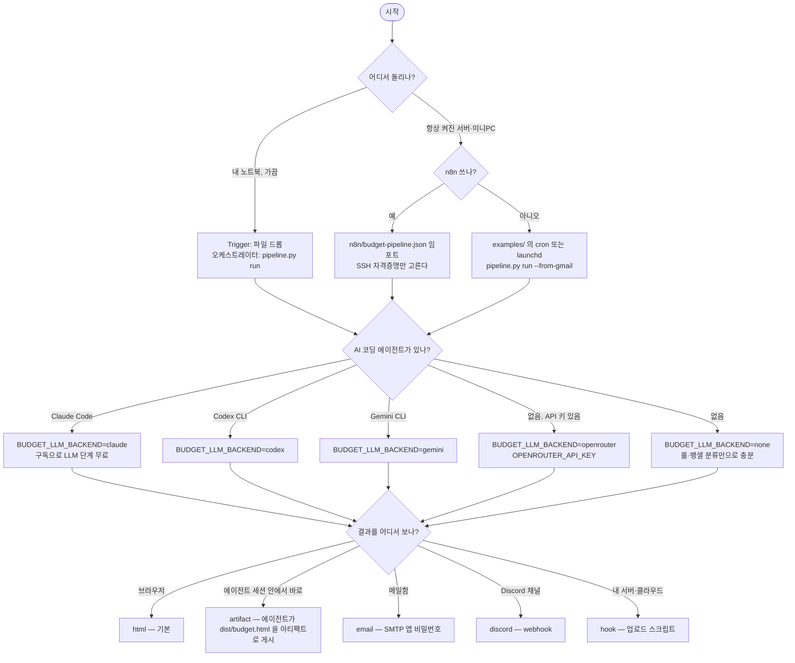

# banksalad-budget-organizer

뱅크샐러드 가계부 export 한 통을 **적재 → 태깅 → 주문메일로 품목 보강 → LLM 용도 추론 → 리포트 → 원하는 곳으로 전달**까지
사람 손 없이 정리하는 파이프라인. 사람이 하는 일은 뱅샐 앱에서 "설정 → 데이터 내보내기 → 파일로 받기" 한 번이다.

n8n 으로 운영 중인 것을 **n8n 없이도 돌아가게** 발췌·추상화한 공개판이다. 단계마다 선택지를 골라
자기 환경에 맞춰 조립한다 — 트리거·보강·LLM·도착지 전부 env 한 줄로 바뀐다.

<p align="center"></p>

## 워크플로 — Trigger / Task / Target

```mermaid
flowchart LR
  subgraph TRIGGER["① Trigger — export 를 어떻게 받나"]
    T1[파일 드롭<br/>--file export.xlsx]
    T2[Gmail 자동 수신<br/>--from-gmail]
    T3[재태깅<br/>--retag]
  end
  subgraph TASK["② Task — 단계 (각각 서브커맨드 1개)"]
    direction LR
    S1[ingest<br/>SQLite 적재<br/>백업·upsert] --> S2[tag<br/>룰·결제수단·오버라이드]
    S2 --> S3[match-*<br/>쿠팡·컬리·네이버페이<br/>주문메일 → 품목]
    S3 --> S4[apply<br/>우선순위 확정]
    S4 --> S5[llm<br/>애매한 건만 추론]
    S5 --> S6[export<br/>csv · json · html]
  end
  subgraph TARGET["③ Target — 어디로"]
    O1[로컬 HTML]
    O2[이메일]
    O3[Discord]
    O4[hook 스크립트<br/>scp·S3·Pages…]
    O5[AI 세션 아티팩트]
  end
  TRIGGER --> S1
  S6 --> TARGET
```



### 단계별 선택지

| 단계 | 기본값 (설정 0개) | 선택지 | 켜는 방법 |
|---|---|---|---|
| ① Trigger | 파일 드롭 | Gmail 자동 수신 · 재태깅 · n8n 스케줄 · cron/launchd | `--from-gmail` (토큰 1회 발급) / `n8n/budget-pipeline.json` / `examples/` |
| ② 보강 | 건너뜀 | 쿠팡(주문·이츠·와우) · 컬리(주문·멤버스) · 네이버페이 | Gmail 토큰이 있으면 자동으로 켜짐. 끄기 `BUDGET_ENRICH=0` |
| ② LLM | OpenRouter | `claude` (Claude Code CLI) · `codex` (Codex CLI) · `gemini` (Gemini CLI) · `none` | `BUDGET_LLM_BACKEND=` |
| ③ Target | `dist/budget.html` | `email` · `discord` · `hook` · `artifact` — 콤마로 여러 개 | `BUDGET_TARGETS=html,discord` |
| 알림 | stderr | Discord 결과 카드 | `BUDGET_DISCORD_WEBHOOK_URL=` |
| 오케스트레이터 | `pipeline.py run` 한 프로세스 | n8n (SSH 노드 1개 = 단계 1개) | n8n JSON 임포트 |

## 5분 퀵스타트 (샘플 데이터)

```bash
git clone https://github.com/ggplab/banksalad-budget-organizer && cd banksalad-budget-organizer
python3 -m venv .venv && .venv/bin/pip install -r requirements.txt     # Python 3.10+
.venv/bin/python pipeline.py run --file samples/sample-export.xlsx --dry-run
open dist/budget.html
```

stdout 에 단계마다 JSON 한 줄이 찍히고 `dist/` 에 `budget.csv` · `summary.json` · `budget.html` 이 생긴다.
Gmail 토큰·API 키가 없으니 보강과 LLM 은 `skipped` 로 지나간다 — 그래도 태깅·리포트는 완성된다.

```
{"node":"ingest","ok":true,"rows_total":159,"rows_new":159,"db_count":159,"db_range":["2026-01-01","2026-06-25"]}
{"node":"tag","ok":true,"rules":72,"method":147,"overrides":1}
{"node":"match-coupang","ok":true,"skipped":true,"because":"no-gmail-token"}
{"node":"apply","ok":true,"purpose_source":{"banksalad":73,"rule":72,"override":1,"banksalad-sub":1}}
{"node":"llm","ok":true,"skipped":true,"because":"BUDGET_LLM_BACKEND=none"}
{"node":"export","ok":true,"csv_rows":159,"html_kb":20,"last_month":"2026-06","targets":{"html":{"ok":true}}}
```

### 내 데이터로

1. 뱅샐 앱 → 설정 → 데이터 내보내기 → 파일로 받기 (zip 비밀번호를 정한다). 메일로 zip 이 온다.
2. `cp .env.example .env` 후 `BUDGET_ZIP_PASSWORD=` 채우기 (xlsx 를 풀어서 넘기면 이것도 불필요).
3. `rules/*.example.yaml` 을 `rules/*.yaml` 로 복사해 자기 가맹점·결제수단으로 고친다 (안 해도 example 이 그대로 적용된다).
4. `.venv/bin/python pipeline.py run --file ~/Downloads/뱅샐_export.zip`

## 어떤 조합으로 돌릴까 — 환경별 선택 flowchart



서버에서 `claude`·`codex`·`gemini` CLI 백엔드를 쓸 때 한 가지 함정: **ssh 세션이나 launchd 에서는 CLI 가 로그인
키체인에 못 닿아 "Not logged in" 으로 죽을 수 있다.** 그 머신의 GUI 세션(터미널 앱)에서 한 번 로그인해 두고,
그래도 안 되면 `openrouter` 로 두는 편이 빠르다.

## AI 에이전트로 세팅하기 — 시작 프롬프트

Claude Code · Codex · Gemini CLI 어느 것이든, repo 를 열고 [`docs/start-prompt.md`](docs/start-prompt.md) 의 프롬프트를
붙여 넣으면 에이전트가 위 flowchart 의 질문을 순서대로 묻고 `.env` 와 룰 파일을 채운 뒤 샘플 → 실데이터 순으로 돌려 준다.
`artifact` 도착지는 이 경로에서만 의미가 있다 — 에이전트가 `dist/budget.html` 을 그 세션의 아티팩트로 띄운다.

## 무엇이 어떻게 붙나 — 실제 예시

금액은 공개용으로 줄였다. 품목·근거 표기는 실제 파이프라인 출력 그대로다.

<p align="center"></p>

- **coupang** — 주문메일 품목으로 용도를 정한다 (쿠팡 카드전표는 전부 "쿠팡(쿠페이)" 라 이게 없으면 생활용품/식비/육아를 못 가른다)
- **rule** — `rules/merchant_rules.yaml` 정규식. 사람이 확정한 판정이라 LLM 보다 세다
- **naver → rule** — 네이버페이 메일에서 실제 결제처(Steam, 세스코몰)를 끌어온 뒤 룰이 잡는다
- **llm 0.90** — 룰에도 안 걸리고 뱅샐 분류도 '미분류' 인 것만 LLM 에 묻는다. 확신도 0.6 미만은 버린다

실패하면 어디서 끊겼는지 카드가 보여 준다. 상류가 죽으면 하류는 낡은 DB 위에서 돌지 않고 `건너뜀` 으로 남는다.

<p align="center"></p>

리포트 HTML (`dist/budget.html`, 단일 파일):

<p align="center"></p>

> 운영자는 여기에 월간 카드(쿠팡·컬리 전월 대비, 카드 실적 달성, D-day)를 하나 더 붙여 쓴다. 이 repo 범위 밖이고
> `summary.json` 을 읽어 만들면 된다 — 반응 있으면 v0.2 에 넣는다.
>
> <p align="center"></p>

## 단계별 실행 (n8n·cron 이 부르는 방식)

```bash
python3 pipeline.py fetch-export --from-gmail   # run.json 생성 + 락
python3 pipeline.py ingest
python3 pipeline.py tag
python3 pipeline.py match-coupang && python3 pipeline.py match-kurly && python3 pipeline.py match-naver
python3 pipeline.py apply
python3 pipeline.py llm
python3 pipeline.py export --target html,discord
python3 pipeline.py finish                      # 결과 카드 + 락 해제
python3 pipeline.py status                      # 락·seen·진행 중 run
```

`run` 은 이 순서를 한 프로세스에서 도는 것뿐이다 (`--from tag`, `--only export`, `--skip llm` 로 슬라이싱).
실패 단계가 생기면 `run.json.failed` 가 세워지고 이후 단계는 `skipped` 로 통과한다 — n8n SSH 노드처럼 종료코드를
무시하는 오케스트레이터에서도 안전하다. 두 실행이 겹치면 락이 두 번째를 미룬다.

### n8n 경로

`n8n/budget-pipeline.json` 을 임포트하고 (1) SSH 자격증명 (2) `0. 환경` 노드의 `home`·`python` 두 값만 고친다.
Schedule 15분 폴링 + Manual/Webhook 재태깅 트리거가 들어 있다. 노드 = 단계 1개라 캔버스에서 어느 단계가 깨졌는지 바로 보인다.

## 설계에서 지킨 것

- **dedup 이 아니라 upsert.** 앱에서 과거 건을 재분류하면 다음 export 에 실려 온다. "이미 있음" 으로 버리면 영원히 반영 안 된다. 단, 최신 export 에 없는 행을 지우지는 않는다(계좌 연동 해지 시 과거 내역 유실 방지).
- **dedup 키에 발생순번.** 같은 초·같은 금액·같은 가맹점이 정당하게 여러 건 있다(지하철). 자연키만 쓰면 잃는다.
- **환불은 '지출' 타입의 양수 행.** 원본 부호를 보존하고 계산은 양수 도메인(`spend = -amount`)에서만 한다.
- **결정적 신호를 확률 추론으로 덮지 않는다.** 오버라이드 > 쿠팡 품목 > 룰 > LLM > 뱅샐 분류. LLM 은 마지막 칸만 채운다.
- **룰 yaml 이 진실.** 룰이 매칭되면 값을 덮는다(COALESCE 아님). 아니면 첫 실행 결과가 굳어 yaml 을 고쳐도 안 바뀐다.
- **네이버페이는 메일 1통 : 거래 N건.** 결제수단별로 행이 갈린다(카드 + 포인트). 1:1 소진을 쓰면 형제 행이 못 붙는다.
- **LLM 은 소프트 실패.** 죽어도 파이프라인은 계속 간다. 결정적 단계의 산출물은 LLM 없이도 유효하다.

## 한계

- 뱅크샐러드 export 의 시트명·컬럼 구조(`가계부 내역`, 10컬럼)에 의존한다. 바뀌면 `banksalad_ingest.COLUMNS` 를 맞춘다.
- 주문메일 파서는 쿠팡·컬리·네이버페이의 2026년 템플릿 실측 기준이다. 템플릿이 바뀌면 `tests/` 픽스처부터 고친다.
- Gmail 보강은 자기 GCP OAuth 클라이언트가 필요하다 (10분, `scripts/gmail_client.py` docstring). 퀵스타트 범위 밖.
- macOS 에서 실측했다. Linux 는 cron 예시까지만 두었고 실측하지 않았다.

## 구조

| 경로 | 역할 |
|---|---|
| `pipeline.py` | 오케스트레이터 — 단계 서브커맨드 + `run` |
| `scripts/banksalad_ingest.py` | xlsx → SQLite (upsert, 발생순번) |
| `scripts/expense_tagger.py` | 룰·결제수단·오버라이드·쿠팡/컬리 파서·뱅샐 fallback·LLM |
| `scripts/naver_pay_mail.py` | 네이버페이 메일 파서 (1:N 매칭) |
| `scripts/gmail_client.py` | Gmail readonly (표준 라이브러리만) — export 수신·주문메일 |
| `scripts/export_budget.py` | csv·json·html + 도착지(email·discord·hook) |
| `rules/*.example.yaml` | 가맹점 룰 · 건별 오버라이드 · 귀속 설정 샘플 |
| `samples/` | 가공 export 생성기 + xlsx (159행) |
| `tests/` | 파서·적재·태깅 단위 테스트 (`python -m unittest discover -s tests`) |
| `n8n/` | 워크플로 JSON |
| `examples/` | cron · launchd 예시 |
| `docs/` | 시작 프롬프트, 이미지 |

MIT · © 2026 BuildnWrite
